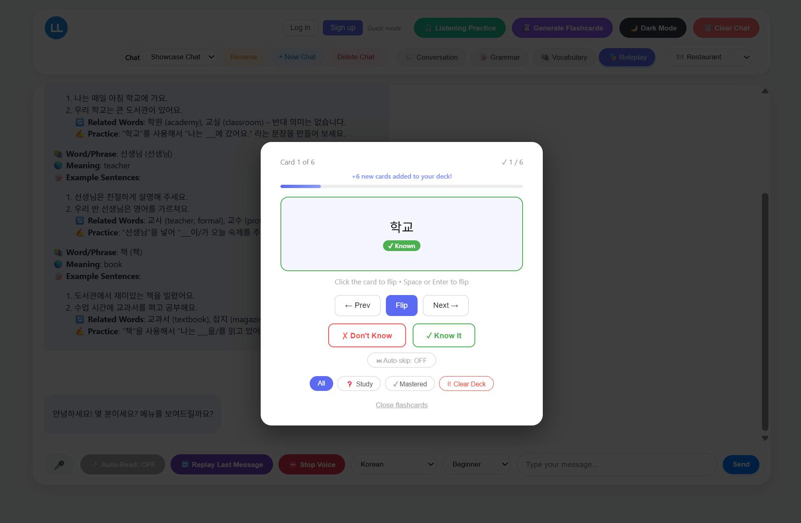
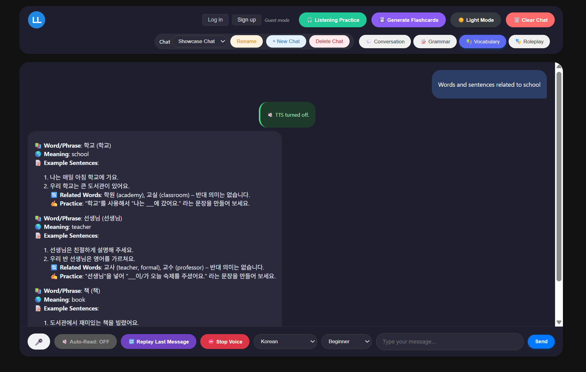
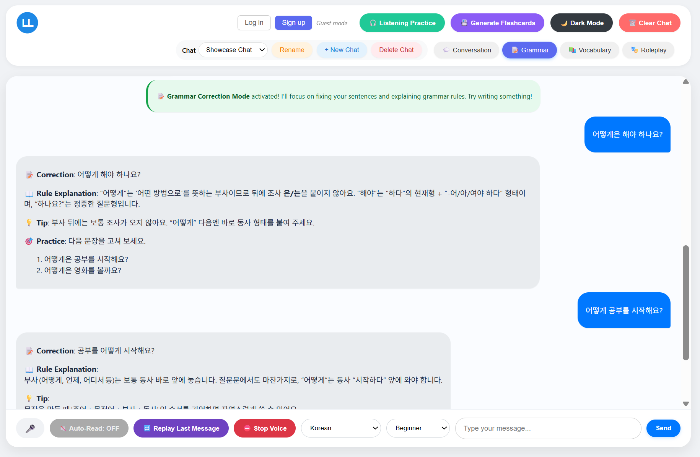

**Français** | [English](./README.md)

# 🌍 Apprentissage des langues par l'IA

Une plateforme d'apprentissage des langues par l'IA « full-stack » qui offre un environnement d'entraînement immersif et interactif. Participez à des conversations dynamiques, maîtrisez la grammaire, enrichissez votre vocabulaire et testez vos compétences à travers des scénarios concrets. Le tout s'appuie sur un backend Node.js moderne, avec une authentification complète des utilisateurs et un stockage persistant dans le cloud.

> **Vidéo de démonstration et captures d'écran** dans le répertoire `/screenshots`.

---

## Voir en ligne

[](https://ai-language-learning.onrender.com/)

---

## Vidéo de présentation

https://github.com/user-attachments/assets/afb80c07-449f-48d3-b7ae-88455e3141f8

---

## Captures d'écran

<p align="center">
  
   
  
</p>

*De gauche à droite : interface des fiches, aperçu du mode sombre et mode grammaire.*

---

## Présentation

AI Language Learning est une application web full-stack qui offre un environnement interactif pour pratiquer les langues étrangères avec un tuteur IA.

Les utilisateurs peuvent suivre des modes d'apprentissage structurés tels que la conversation, la correction grammaticale, l'enrichissement du vocabulaire et des jeux de rôle basés sur des scénarios. Le système conserve les sessions de chat, l'historique d'apprentissage et les fiches de révision afin de soutenir la progression à long terme.

L'application est construite selon une architecture client-serveur RESTful utilisant un backend Node.js + Express et un frontend JavaScript vanilla. Elle intègre un modèle d'IA via OpenRouter et stocke les données utilisateur dans une base de données PostgreSQL.

L'objectif de ce projet est de simuler une plateforme d'apprentissage de type production avec authentification, état persistant et services backend modulaires, plutôt qu'une simple interface de chat.

---

## Fonctionnalités

### Quatre modes d'apprentissage dynamiques
Passez instantanément d'un style d'entraînement ciblé à un autre :
- **Conversation** — Entraînez-vous à des dialogues naturels et ouverts. L'IA corrige en douceur les erreurs et pose des questions complémentaires.
- **Grammaire** — Bénéficiez de corrections ciblées, d'explications détaillées des règles et d'exercices pratiques.
- **Vocabulaire** — Apprenez de nouveaux mots, des synonymes et des exemples d'utilisation en contexte.
- **Jeu de rôle** — Plongez-vous dans des scénarios réels tels que passer une commande au restaurant, s'enregistrer à l'hôtel ou s'orienter dans un aéroport.

### Exercices d'écoute interactifs
L'IA prononce une phrase dans la langue cible, vous la répétez à l'aide de votre microphone et vous obtenez un retour instantané avec un score de précision pour affiner à la fois votre compréhension et votre prononciation.

### Fiches de vocabulaire générées par l'IA
Générez automatiquement un jeu de fiches de vocabulaire à partir de votre historique de conversations. Étudiez dans une interface dédiée aux fiches, marquez les cartes comme connues ou inconnues et suivez vos progrès au fil du temps.

### Exercices de complétion
Exercices de complétion générés par l'IA. Chaque question présente une phrase dans laquelle il manque un mot, ainsi que trois propositions au choix, avec un indice disponible dans la langue cible.

### Outils vocaux intégrés
- **Reconnaissance vocale** — Exprimez vos réponses à l'oral plutôt qu'à l'écrit.
- **Synthèse vocale** — Activez la lecture automatique pour que les réponses de l'IA soient lues à voix haute. Relancez ou arrêtez la lecture à tout moment.

### Authentification complète de l'utilisateur
- Inscription et connexion sécurisées grâce à des mots de passe hachés avec **bcrypt**.
- Jetons d'accès **basés sur JWT** (expiration après 15 minutes) avec des **jetons de rafraîchissement** rotatifs (expiration après 30 jours) stockés sous forme de cookies HttpOnly.
- Rotation des jetons à chaque rafraîchissement et révocation explicite lors de la déconnexion.

### Persistance des données dans le cloud
Une fois connecté, toutes les sessions de chat, les messages, les fiches et les paramètres sont synchronisés vers une base de données **PostgreSQL**, afin que vos données vous suivent sur tous vos appareils.

### Gestion des sessions
- Créez, renommez, supprimez et passez d'une session de chat à l'autre.
- Les paramètres de langue, de difficulté, de mode et de lecture automatique par session sont enregistrés automatiquement.
- Les invités utilisent le `localStorage` du navigateur ; les utilisateurs authentifiés se synchronisent avec le cloud.

### Expérience personnalisable
- Langues : espagnol, français, allemand, italien, japonais, coréen, mandarin, portugais, arabe standard moderne et hindi.
- Niveaux de difficulté : débutant, intermédiaire, avancé.
- Basculer entre les thèmes clair et sombre.

### Limitation du débit
L'API est protégée contre les abus grâce à une limitation du débit par route via `express-rate-limit` :
- **`/api/ai/ask`** — les visiteurs sont limités à 10 requêtes par minute (en fonction de l'adresse IP) ; les utilisateurs authentifiés ont droit à 30 requêtes par minute (en fonction de l'identifiant utilisateur). Tout dépassement de cette limite entraîne le renvoi d’une réponse `429` accompagnée d’un message convivial dans l’interface utilisateur.
- **`/api/auth`** — tous les points de terminaison d’authentification (connexion, inscription, actualisation) sont limités à 20 requêtes toutes les 15 minutes par adresse IP, ce qui permet de se prémunir contre les attaques par force brute.

---

## Architecture du système

Le système est conçu comme une architecture full-stack en couches séparant l'interface utilisateur, la logique API, les services et la persistance pour assurer l'évolutivité et la maintenabilité.

```
Frontend (Vanilla JS)
        ↓
API REST (Express)
        ↓
Middleware de limitation de débit
        ↓
Couche de contrôleurs
        ↓
Services (IA / Authentification / Logique)
        ↓
Base de données PostgreSQL
```

### Gestion des erreurs

L'application repose sur un patron de gestion centralisée des erreurs :

- **`AppError`** (`src/utils/AppError.js`) — une classe d'erreur personnalisée qui encapsule un message et un code de statut HTTP, utilisée dans l'ensemble des contrôleurs pour lever des erreurs cohérentes et typées.
- **`errorHandler`** (`src/middleware/errorHandler.js`) — un middleware de gestion d'erreurs Express enregistré en fin de chaîne. Il intercepte toutes les instances `AppError` levées (ainsi que les erreurs inattendues) et retourne une réponse JSON uniforme, maintenant la logique d'erreur hors des contrôleurs individuels.
- **Transmission de la limite de débit d'OpenRouter** — lorsqu'OpenRouter renvoie un code `429` (limite par minute du modèle gratuit), le contrôleur IA l'intercepte et transmet un `429` au client accompagné d'un message clair, au lieu de le masquer sous la forme d'une erreur serveur générique.

---

## Pile technologique

| Couche | Technologie |
|---|---|
| **Frontend** | HTML5, CSS3, Vanilla JavaScript |
| **Backend** | Node.js, Express 5 |
| **Style d'architecture** | API RESTful |
| **Service IA** | [API OpenRouter](https://openrouter.ai/) (compatible OpenAI) |
| **Base de données** | PostgreSQL (`pg`) |
| **Stockage** | Système hybride cloud + local |
| **Auth** | JWT (`jsonwebtoken`) (rotation des jetons) + bcrypt |
| **Limitation du débit** | `express-rate-limit` |
| **Outils de développement** | Nodemon, dotenv |
| **Tests** | Jest |

---
## Référence API

Toutes les routes API sont préfixées par `/api`.

### Authentification — `/api/auth`
| Méthode | Point de terminaison | Description |
|---|---|---|
| `POST` | `/signup` | Enregistrer un nouvel utilisateur |
| `POST` | `/login` | Se connecter et recevoir des jetons |
| `POST` | `/logout` | Révoquer le jeton de rafraîchissement et effacer les cookies |
| `POST` | `/refresh` | Renouveler le jeton de rafraîchissement, émettre un nouveau jeton d'accès |
| `GET` | `/me` | Renvoyer l'utilisateur actuellement authentifié |

### Utilisateurs — `/api/users` *(authentification requise)*
| Méthode | Point de terminaison | Description |
|---|---|---|
| `GET` | `/me` | Renvoie l'adresse e-mail de l'utilisateur actuel (à ne pas confondre avec `/api/auth/me`, qui renvoie les informations d'authentification et de session) |
| `PUT` | `/settings` | Met à jour ou ajoute le thème, la langue, le niveau de difficulté et les préférences de lecture automatique de l'utilisateur |

### Chats — `/api/chats` *(authentification requise)*
| Méthode | Point de terminaison | Description |
|---|---|---|
| `GET` | `/` | Lister tous les chats de l'utilisateur |
| `GET` | `/:id` | Récupérer un chat et ses messages |
| `POST` | `/` | Créer une nouvelle session de chat |
| `PUT` | `/:id` | Mettre à jour les paramètres du chat (titre, mode, langue, etc.) |
| `DELETE` | `/:id` | Supprimer un chat et tous ses messages |
| `POST` | `/:id/messages` | Ajouter un message à un chat |

### Fiches — `/api/flashcards` *(authentification requise)*
| Méthode | Point de terminaison | Description |
|---|---|---|
| `GET` | `/` | Afficher la liste de toutes les fiches |
| `POST` | `/bulk` | Ajouter une ou plusieurs fiches à la fois (accepte un tableau) |
| `PATCH` | `/:id` | Marquer une fiche comme connue/inconnue (incrémente le nombre de révisions) |
| `DELETE` | `/` | Supprimer **toutes** les fiches de l'utilisateur actuel |

### IA — `/api/ai`
| Méthode | Point de terminaison | Description |
|---|---|---|
| `POST` | `/ask` | Envoie une question ; renvoie une réponse du tuteur IA. Limite de requêtes : 10 requêtes/min (utilisateurs non authentifiés), 30 requêtes/min (utilisateurs authentifiés). |

### Stockage — `/api/storage` *(authentification requise)*
| Méthode | Point de terminaison | Description |
|---|---|---|
| `GET` / `POST` | `/bulk` | Récupération simultanée de plusieurs valeurs stockées (utilisation de `POST` pour transmettre les clés dans le corps de la requête) |
| `GET` | `/:key` | Récupérer une valeur stockée par clé |
| `PUT` | `/:key` | Définir / mettre à jour une valeur stockée |
| `DELETE` | `/:key` | Supprimer une clé stockée |

---

## Schéma de la base de données

| Table | Objectif |
|---|---|
| `users` | E-mail, mot de passe haché, nom d'affichage |
| `refresh_tokens` | Jetons de rafraîchissement persistants avec date d'expiration |
| `user_settings` | Thème, langue, niveau de difficulté et préférences de lecture automatique par utilisateur |
| `user_storage` | Stockage clé/valeur générique pour la synchronisation de l'état du client |
| `chats` | Sessions de chat avec paramètres de mode, langue, niveau de difficulté et scénario |
| `chat_messages` | Messages individuels (expéditeur, texte, HTML) par discussion |
| `flashcards` | Fiches de vocabulaire avec statut connu/inconnu et nombre de révisions |

---

## Structure du projet

```
ai-language-learning/
├── public/                   # Interface statique
│   ├── index.html
│   ├── logo.svg / logo.ico
│   ├── css/                  
│   │   ├── main.css          # Fichier principal (importe tous les fichiers ci-dessous)
│   │   ├── base.css          # Réinitialisation et styles de base
│   │   ├── dark.css          # Thème du mode sombre
│   │   ├── auth.css          # Styles de la fenêtre modale d'authentification
│   │   ├── chat.css          # Styles de la fenêtre de chat et des messages
│   │   ├── input.css         # Styles des zones de saisie et des boutons
│   │   ├── cloze.css         # Styles de superposition pour les exercices de Cloze
│   │   └── header.css        # Styles de l'en-tête, de la navigation et du sélecteur de mode
│   └── js/
│       ├── main.js           # Point d'entrée de l'application et logique de l'interface utilisateur
│       ├── auth.js           # Flux d'authentification
│       ├── chat.js           # Gestion des sessions de chat
│       ├── flashcards.js     # Interface des fiches de vocabulaire
│       ├── languages.js      # Définitions partagées des langues
│       ├── listening.js      # Module d'entraînement à l'écoute
│       ├── cloze.js          # Module d'exercices de type « Cloze » (à trous)
│       ├── appStorage.js     # Synchronisation du stockage cloud
│       └── storage.js        # Aides au stockage local
├── src/
│   ├── controllers/
│   │   ├── aiController.js       # Construction des invites IA & appels OpenRouter
│   │   ├── authController.js     # Inscription, connexion, déconnexion, actualisation, /me
│   │   ├── chatController.js     # CRUD du chat + gestion des messages
│   │   ├── flashcardController.js
│   │   ├── storageController.js  # Stockage cloud clé/valeur par utilisateur
│   │   └── userController.js
│   ├── db/
│   │   ├── connection.js         # Configuration du pool pg
│   │   └── schema.sql            # Schéma complet de la base de données
│   ├── middleware/
│   │   ├── authMiddleware.js     # Middleware de vérification JWT
│   │   └── errorHandler.js      # Gestionnaire centralisé des erreurs AppError
│   ├── routes/
│   │   ├── ai.js
│   │   ├── auth.js
│   │   ├── chats.js
│   │   ├── flashcards.js
│   │   ├── storage.js
│   │   └── users.js
│   ├── services/
│   │   └── openrouter.js         # Client compatible OpenAI pour OpenRouter
│   └── utils/
│       ├── AppError.js           # Classe d'erreur personnalisée avec codes HTTP
│       ├── hash.js               # Aides bcrypt
│       └── jwt.js                # Signature/vérification des jetons d'accès et de rafraîchissement
├── tests/
│   ├── authController.test.js
│   ├── aiController.test.js
│   ├── chatController.test.js
│   ├── flashcardController.test.js
│   ├── authMiddleware.test.js
│   ├── hash.test.js
│   └── jwt.test.js
├── screenshots/
├── jest.config.js            # Configuration Jest
├── server.js                 # Point d'entrée de l'application Express
├── package.json
└── .env                      # Variables d'environnement (non validées)
```

---

## Conception de l'authentification

- **Jetons d'accès** — JWT à courte durée de vie (15 min) fournis sous forme de cookie `HttpOnly`.
- **Jetons de rafraîchissement** — JWT à longue durée de vie (30 jours) stockés à la fois dans un cookie `HttpOnly` (dont l'accès est limité au chemin `/api/auth/refresh`) et dans la base de données en vue de leur révocation.
- **Rotation des jetons** — chaque appel de rafraîchissement supprime l'ancien jeton et émet une nouvelle paire, empêchant ainsi les attaques par rejeu.
- **Déconnexion** — supprime explicitement le jeton d'actualisation de la base de données et efface les deux cookies.

---

## Défis

- Synchronisation de l'état du chat IA avec le stockage persistant en base de données
- Conception d'une rotation sécurisée des jetons avec révocation des jetons d'actualisation
- Gestion d'un système de stockage double (localStorage vs PostgreSQL)
- Structuration de contrôleurs backend modulaires pour l'évolutivité
- Mise en place d'une limitation de débit à plusieurs niveaux qui protège le point de terminaison IA sans nuire à l'expérience utilisateur

## Pour commencer

### Prérequis
- **Node.js** v18+ et **npm**
- Une base de données **PostgreSQL** (locale ou hébergée)
- Une **clé API OpenRouter** — [obtenez-en une ici](https://openrouter.ai/keys)

### Installation

1. **Cloner le dépôt**
   ```sh
   git clone https://github.com/deryokoya/ai-language-learning.git
   cd ai-language-learning
   ```

2. **Installez les dépendances**
   ```sh
   npm install
   ```

3. **Configurez la base de données**

   Exécutez le fichier de schéma sur votre instance PostgreSQL :
   ```sh
   psql -U <votre_utilisateur> -d <votre_base_de_données> -f src/db/schema.sql
   ```

4. **Configurer les variables d'environnement**

   Copiez le fichier d'exemple et remplacez-le par vos propres valeurs :
   ```sh
   cp .env.example .env
   ```

   | Variable | Obligatoire | Description |
   |---|---|---|
   | `PORT` | Non (valeur par défaut : `3000`) | Port sur lequel le serveur Express est à l'écoute |
   | `DATABASE_URL` | Oui | Chaîne de connexion PostgreSQL |
   | `OPENROUTER_API_KEY` | Oui | Clé API provenant d'[OpenRouter](https://openrouter.ai/keys) |
   | `JWT_SECRET` | Oui | Chaîne aléatoire longue utilisée pour signer les jetons d'accès |
   | `JWT_REFRESH_SECRET` | Non (valeur par défaut : `JWT_SECRET + « _refresh »`) | Secret distinct pour la signature des jetons de rafraîchissement |

5. **Lancer l'application**

   Mode développement (rechargement automatique avec Nodemon) :
   ```sh
   npm run dev
   ```

   Mode production :
   ```sh
   npm start
   ```

6. **Ouvrez dans votre navigateur**
   ```
   http://localhost:3000
   ```

### Exécuter les tests

Le projet inclut une suite de tests Jest complète couvrant les contrôleurs, les middlewares et les utilitaires. Consultez la section [Tests](#tests) pour les détails et la liste complète des fichiers.

---

## Tests

Le projet est livré avec une suite Jest couvrant le cœur du backend :

| Fichier | Ce qui est testé |
|---|---|
| `authController.test.js` | Flux d'inscription, connexion, déconnexion, actualisation et `/me` |
| `aiController.test.js` | Construction des invites IA et traitement des réponses OpenRouter |
| `chatController.test.js` | Opérations CRUD du chat et gestion des messages |
| `flashcardController.test.js` | Création, mise à jour et suppression des fiches |
| `authMiddleware.test.js` | Vérification JWT et comportement du garde de requête |
| `hash.test.js` | Aides au hachage et à la comparaison bcrypt |
| `jwt.test.js` | Signature et vérification des jetons d'accès et de rafraîchissement |

Exécuter la suite :

```sh
npm test              # exécuter une fois
npm run test:coverage # avec rapport de couverture
```

---

## Contribuer

Les pull requests sont les bienvenues. Pour les modifications importantes, veuillez d'abord ouvrir un ticket afin de discuter des changements que vous souhaitez apporter.

---

## Licence

[MIT](./LICENSE) — pour plus de détails, consultez le fichier [LICENSE](./LICENSE).